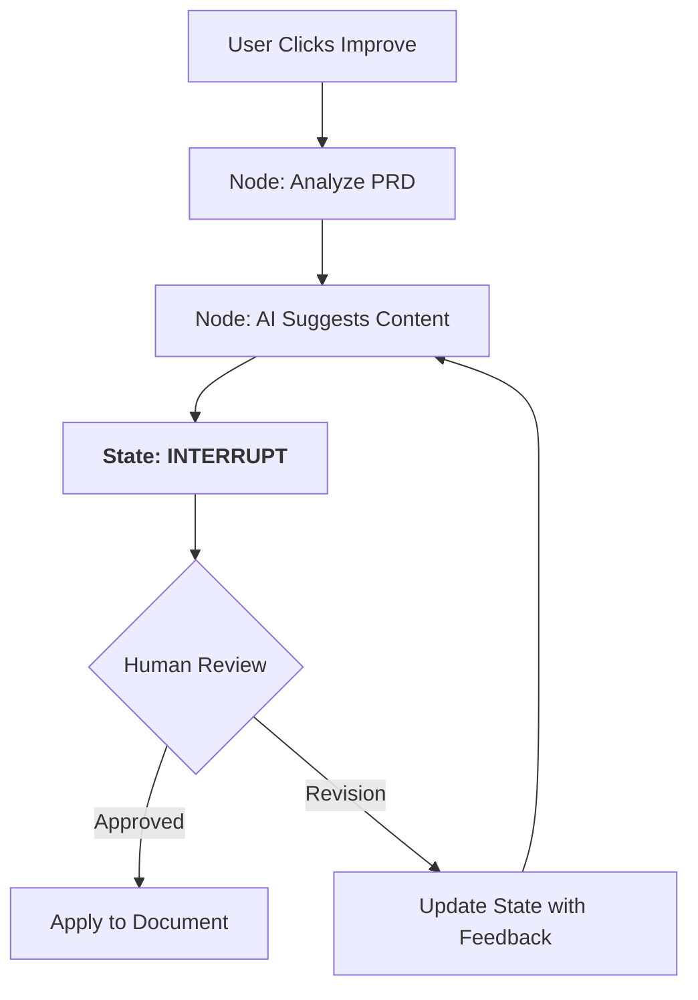

# AOP Planner: Architecture Evolution (v1.0)

This document outlines the strategic migration of the AOP Planner from a monolithic Flask application to a modern, asynchronous FastAPI architecture powered by LangGraph and Human-in-the-Loop (HITL) workflows.

---

## ⚡ Executive Summary: Before vs. After

| Feature | Legacy Architecture (Flask) | Modern Architecture (FastAPI + LangGraph) |
| :--- | :--- | :--- |
| **Backend Framework** | Monolithic Flask (Synchronous) | High-performance FastAPI (Asynchronous) |
| **AI Strategy** | Direct LLM completions | Agentic Workflows via **LangGraph** |
| **User Control** | Automated (Black-box) improvements | **HITL** Review & Feedback Loop |
| **State Management** | Stateless/Session-based | Persistent State Snapshots & Checkpointing |
| **Scalability** | Blocking I/O | Non-blocking, handles long-running AI tasks |

---

## 🏗️ Core Architectural Shifts

### 1. From Monolith to Modular
The application has been restructured for maintainability and separation of concerns:
- **`main.py`**: Clean entry point with FastAPI routers and middleware.
- **`dependencies.py`**: Centralized configuration and resource management (OpenAI, Templates, DB paths).
- **`routers/`**: Logical API grouping (e.g., `workflow.py` for all AI logic).
- **`workflows/prd_agent.py`**: Encapsulated LangGraph logic.

### 2. The Power of LangGraph & HITL
Iterative AI improvement is no longer a single API call. It is now a managed **State Machine**:

> [!IMPORTANT]
> **Checkpointer Security**: The system uses `MemorySaver` to "hibernate" the AI workflow while waiting for user feedback. This means the server doesn't "hang" while waiting—it resumes exactly where it left off.

---

## 🛠️ Key Technical Implementations

### AI Assistant & Workflow Endpoints
The new API design provides clearer contracts for frontend integration:
- `POST /api/workflow/start`: Initiates a thread and returns an ID.
- `GET /api/workflow/{thread_id}/state`: Polls the current state of the AI's mind.
- `POST /api/workflow/{thread_id}/review`: Allows you to `approve` or `reject` (with feedback).
- `POST /api/workflow/chat`: Context-aware companion for real-time document chat.

### Enhanced User Documentation
We've introduced several key artifacts to help developers:
- [Implementation Plan](./implementation_plan.md) - Technical roadmap.
- [Walkthrough](./walkthrough.md) - Proof of verification.

---

## 🚀 Impact for Team Mates
1. **No More UI Freezes**: Long-running AI analysis runs in the background.
2. **Quality Control**: Users can now reject AI suggestions or ask for specific tweaks before they change the draft.
3. **Reproducibility**: Thread IDs allow us to debug specific AI "conversations" more effectively.

> [!TIP]
> To run the evolution locally, ensure you use `python3 main.py` and have the updated `requirements.txt` installed.
